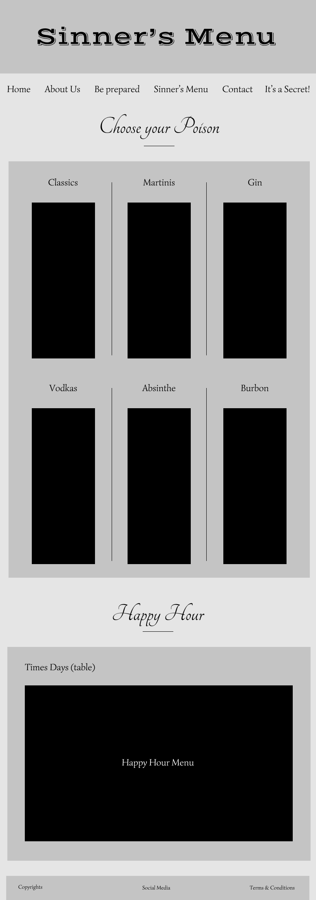
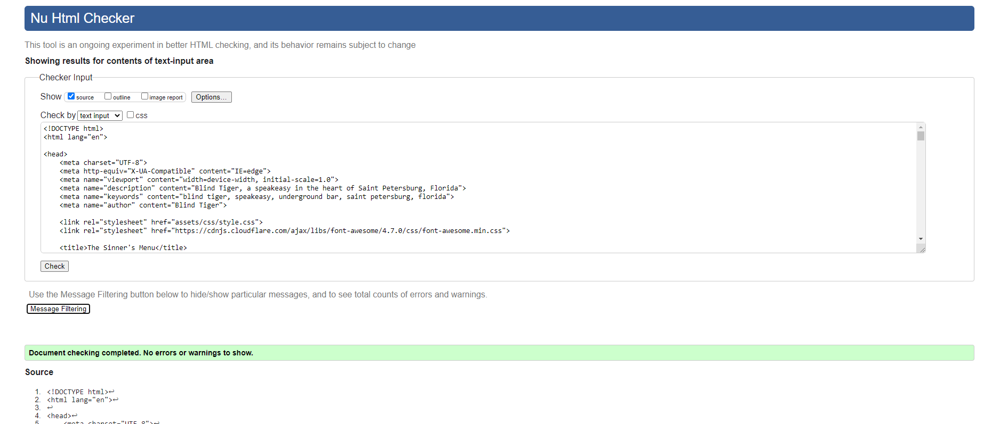

# Blind Tiger

View the live project [here](https://mariapapageorgiou.github.io/blind-tiger/)

## Table of contents
1. [About the "Blind Tiger" Idea](#About-the-"Blind-Tiger"-Idea)
2. [Main Requirements](#Main-Requirements)
3. [UX (User Experience)](#UX-(User-Experience))
    1. [Ideal User](#Ideal-User)
    2. [User Stories](#User-Stories)
4. [Development Planes](#Development-Planes)
    1. [Strategy](#Strategy)
    2. [Scope](#Scope)
    3. [Structure](#Structure)
    4. [Skeleton](#Skeleton)
5. [Design](#Design)
    1. [Colour Scheme](#Colour-Scheme)
    2. [Typography](#Typography)
    3. [Images](#Images)
6. [Features](#Features)
    1. [Design Features](#Design-Features) 
    2. [Existing Features](#Existing-Features)
    3. [Back to the Feature (Features for the Future)](#Back-to-the-Feature-(Features-for-the-Future))
7. [Issues](#Issues)
8. [Technologies Used](#Technologies-Used)
     1. [Main Languages Used](#Main-Languages-Used)
     2. [Libraries, Programs, and Resources](#Libraries,-Programs,-and-Resources)
9. [Testing](#Testing)
10. [Deployment](#Deployment)
11. [Credits](#Credits)
12. [Acknowledgements](#Acknowledgements)
***

## About the "Blind Tiger" Idea

The Blind Tiger website was inspired from my partner's love for the speakeasy bars in New York city. The purpose of the website is to create an online presence for existing and new customers to find out relevant information about the bar, its menu, and get a chance to reveal the secret location of the bar. 

This is a fictional speakeasy bar, established in Saint Petersburg, Florida, around 1921 (prohibition era: 1920-1933). The name "Blind Tiger" was chosen as it was widely used for establishments that sold intoxicants illegally.

This is the first of five Portfolio Projects that must be completed in order to obtain the Diploma in Software Development (E-commerce Applications) from Code Institute. 

[Back to top ⇧](#Blind-Tiger)

## Main Requirements

The main requirements for the Project Portfolio 1:
- Design an interactive Front-End web application using HTML and CSS based on the principles of user experience design, accessibility and responsivity.
- Test a Front-End web application through the development, implementation and deployment stages.
- Deploy a Front-End web application to a Cloud platform.
- Maximise future maintainability through documentation, code structure and organisation.
- Demonstrate and document the development process through a version control system such as GitHub.

[Back to top ⇧](#Blind-Tiger)

## UX (User Experience)

### Ideal User
- New/Potential customers
- Current customers
- Event bookers/Media enquirers

### User Stories
- New/Potential Customers:
     1. I want to navigate through the website to find the relevant information, effortlessly. 
     2. I want to find out if the menu includes my choice of beverage.
     3. I want to find out the hours of operation, and/or the location, and/or the contact information.

- Current Customers:
     1. I want to find information about upcoming events.
     2. I want to see any changes on the menu and happy hour.
     3. I want to be informed about any additions/changes to the rules of the establishment.

- Event Bookers / Media Enquirers:
     1. As a potential booker, I want to navigate to the Blind Tiger's contact content in order to schedule a possible tour of the establishment.
     2. As a media enquirer, I want to find out about the location of the establishment, for media coverage outdoors and if permitted indoors.

[Back to top ⇧](#Blind-Tiger)

## Development Planes

### Strategy

Identifying the target audience:
- Fans of the 1920s
- Fans of the speakeasy bars
- Current customers
- Videographers
- Photographers

The website needs to allow the **user** to acquire desired information:
- The establisment's ethos
- The contact information
- The menu
- How to be informed about upcoming events
- Find out the secret location of the bar
- Connect with them on their preferred social platform

The website needs to provide the **establishment** with:
- An online presence 
- An easily navigable website for users to find relevant information
- A medium of communication for new/potntial and current fans
- A medium of communication for potential media enquirers and/or event bookers

### Scope
In order to accompish the strategy goals, a scope was developed with the followig **Content Requirements**:
- Ethos information
- Contact details
- Menu
- Secret Location form
- Social Links

### Structure
The **hierarchial tree structure** information architecture type was chosen in order to ensure that users will navigate through the site efficiently.

### Skeleton 
The Wireframe mockups were created with a [Figma Workspace](https://www.figma.com/file/llGzlYYGBOKyiv0H1A3NYx/The-Blind-Tiger-Speakeasy?node-id=0%3A1)

Home Page:

Sinner's Menu Page:

It's A Secret Page:

[Back to top ⇧](#Blind-Tiger)

## Design

### Colour Scheme
The main colours used throughout the website are a black, gold, whitesmoke, and shades of dark red and navy blue.

### Typography
The fonts chosen were:
- [Josefin Slab](https://fonts.google.com/specimen/Josefin+Slab "Link to Josefin Slab Google Font") is used for the body, with serif as the fallback font in case of import failure.
- [Great Vibes](https://fonts.google.com/specimen/Great+Vibes "Link to Great Vibes Google Font") is used in the title of the website, with cursive as the fallback font in case of import failure. 
- [Playfair Display](https://fonts.google.com/specimen/Playfair+Display "Link to Playfair Display Google Font") is used for the home page and the sinner's menu page headings, with a serif as the fallback font in case of import failure. 

### Images
After thorough research of appropriate images the following these made the final cut:
- Hero Image:

Photo by Chris F from Pexels can be found [here](https://www.pexels.com/photo/assorted-wine-bottles-1283219/ "Link to Hero Image origin")

- Menu Selection Image:

Photo by Sérgio Alves Santos from unsplash can be found [here](https://unsplash.com/photos/PeDrafNlY2Y "Link to Menu Selection Image origin")

- Newsletter Image:

Photo by Jeremy Bishop from Unsplash can be found [here](https://unsplash.com/photos/uLXBeh6oHn8 "Link to Newsletter Image origin")

- Sinner's Menu Image:

Photo by NastyaSensei Sens from stocksnap can be found [here](https://stocksnap.io/photo/dark-night-9UJ3HU7PR8 "Link to Sinner's Menu Image origin")

- Happy Hour Image:

Photo by cottonbro from Pexels can be found [here](https://www.pexels.com/photo/clear-wine-glass-on-table-5371926/ "Link to Happy Hour Image origin")

- Speakeasy Location Image:

Photo by Pied Piper from Pexels can be found [here](https://www.pexels.com/photo/turned-on-lamp-near-green-plants-1468419/ "Link to Speaseasy Location Image origin")

All images were compressed images with [TinyPNG](https://tinypng.com/ "Link to tinypng.com") and [Compressor](https://compressor.io/ "Link to compressor.io").

[Back to top ⇧](#Blind-Tiger)

## Features

### Design Features

1. The **Header** contains a cosistent and responsive **navigation bar** in the top left of all pages, and a **logo** in the top right of all pages (when clicking the logo the user will be redirect back to the home page). On screens below 850px width, the navigation bar collapses into a menu icon, when clicked it will reveal the navigation bar.

2. The **Footer** contains the **social media icons**, in the bottom left of all pages, the **copyrights** in the bottom middle of all pages, and the **terms & conditions** on the bottom right of all pages. For tablet screens (768px width) and below, the elements of the footer are stacked on top of one another

3. The **Home** page is divided into five sections:
     - Hero Image & Title
     - Be Prepared
     - Sinner's Menu link
     - Contact us 
     - Newsletter

4. The **Sinner's Menu** page is divided into three sections:
     - Sinner's Menu Image & Title
     - Menu
     - Happy Hour

5. The **It's A Secret** page features one section including the following:
     - Secret Location Image
     - Secret Location Title
     - Submission form

All elements were thoroughly checked for responsiveness in all screen sizes. The **Be Prepared** section, **Contact Us** section, and **Secret Location** form are divided in two columns for larger screen sizes. The **Menu** section, is divided into three columns for larger screen sizes. All of the above content is viewed as one column for smaller screen sizes.
 
### Existing Features

- **Header Navigation Bar** - Appears in every page and is positioned at a fixed place in order to ensure easy and effortless access to the navigational system.
- **Header Logo** - Appears in every page for brand recognition and is positioned with the navigation bar at a fixed place. When the logo is clicked the user will be redirected to the home page.
- **Action buttons** - Appear in the Home page and It's A Secret page, not including the Sinner's Menu Page. In the event of the buttons being active, the user will be redirected to internal and external sites such as:
     - Tel function for calling the establishment
     - Mailto function for contacting the establishment's customer support team
     - Menu link to redirect to the menu page
     - Email submission form
     - It's A Secret link to redirect to the It's A Secret page
- **Secret Location Form** - A form is used in the It's A Secret page, so the user can obtain the location of the establishment.
- **Social Media Icons** - Appear in every page. The icons depicts the various social media platforms, when hovered over they turn into the official colors of the coresponding social media platform.

### Back to the Feature (Features for the Future)

- **External Links** - Provide external resources for educational purposes
- **Form Validation** - Implement appropriate knowledge in order to validate the data of the form
- **404 Error Page** - Create a 404 error page to redirect the user back to safety

[Back to top ⇧](#Blind-Tiger)

## Issues 

During the development process, the following issues were successfully corrected:

**Navigation Menu Icon** - While trying to implement a responsive navigation system, a navigation menu icon needed to be created with pure CSS. During research a solution was found and implemented from [CodePen](https://codepen.io/mutedblues/pen/MmPNPG?editors=1100 "Link to CodePen solution").

**Background Images Resizing** - During the development of the responsive part of the website, the background images and sections were not resizing properly. After thorough research online, slack, and trying to implement different techniques such as different structure of the elements, and various attribute combinations, the **Tutor Support** came for the rescue. At 2 AM on a Sunday, **Michael**, the tutor, found the solution to the problem. 

**Social Media Links positioning** - When trying to implement a responsive view for the footer of the website, the social media links were not positioned in the center in contrast with the copyrights and terms & conditions sections. 

[Back to top ⇧](#Blind-Tiger)

## Technologies
### Main Languages
- [HTML5](https://en.wikipedia.org/wiki/HTML5 "Link to HTML Wiki")
- [CSS3](https://en.wikipedia.org/wiki/Cascading_Style_Sheets "Link to CSS Wiki")

### Libraries, Programs, and Resources
- [Figma](https://www.figma.com/ "Link to Figma homepage")
     - Figma was used to create the wireframes during the Skeleton Plane of User Experience.
- [Google Fonts](https://fonts.google.com/ "Link to Google Fonts")
    - Google fonts were used to import the fonts "Great Vibes", "Playfair Display", and "Josefin Slab".
- [Font Awesome](https://fontawesome.com/ "Link to FontAwesome")
     - Font Awesome was used to import the social media icons.
- [Git](https://git-scm.com/ "Link to Git homepage")
     - For version control, Git was used through the GitPod terminal.
- [GitHub](https://github.com/ "Link to GitHub")
     - GitHub was used to create a repository for the project.

[Back to top ⇧](#Blind-Tiger)

## Testing

All [User Stories](#User-Stories) were manually tested and successfully passed all responsive tests.

Code Validation:

1. The [W3C Markup Validator](https://validator.w3.org/) website was used to validate the `HTML` pages.

    - Home Page

         

    - Sinner's Menu Page

         

    - It's A Secret Page

         

2. The [W3C CSS Validator](https://jigsaw.w3.org/css-validator/) website was used to validate the `CSS` code.

## Deployment

The Blind Tiger Portfolio Project 1 was developed using [Gitpod](https://gitpod.io/ "Link to Gitpod")
Git was used for all commits.
Through Git the project was pushed to GitHub using the computer terminal.
Gitpod's terminal was used for all commit and push commands. 
The project was deployed using GitHub Pages.

[Back to top ⇧](#Blind-Tiger)

## Credits 

### Content

- The content of the beer section was inspired by a variety of breweries based in Saint Petersburg, Florida.
- The text used for the alchoholic beverages was found through various websites after a Google search using the keywords "prohibition cocktails", "most popular drinks", "absinthe"
- The text for the multiple choice was found [here](https://prohibition.themobmuseum.org/the-history/prohibition-potpourri/did-you-know/ "Link to Prohibition Era facts and odd stories") and [here](https://www.mentalfloss.com/article/53281/6-absurd-alcohol-myths-people-believed-during-prohibition "Link to Alcohol Myths page")

### Code 
The following resources were used in order to better understand key concepts of the projects and resolve responsiveness issues
- [Stack Overflow](https://stackoverflow.com/ "Link to Stack Overflow page")
- [W3Schools](https://www.w3schools.com/ "Link to W3Schools page")

[Back to top ⇧](#Blind-Tiger)

## Acknowledgements

- I would like to thank my wife, children, family, and friends for their support and valued critic during the project development.
- I would like to thank my mentor, Seun, for her guidance throughout the process.
- I would like to thank my tutor, Michael, for his persistance at 2 AM on a Sunday. 

[Back to top ⇧](#Blind-Tiger)